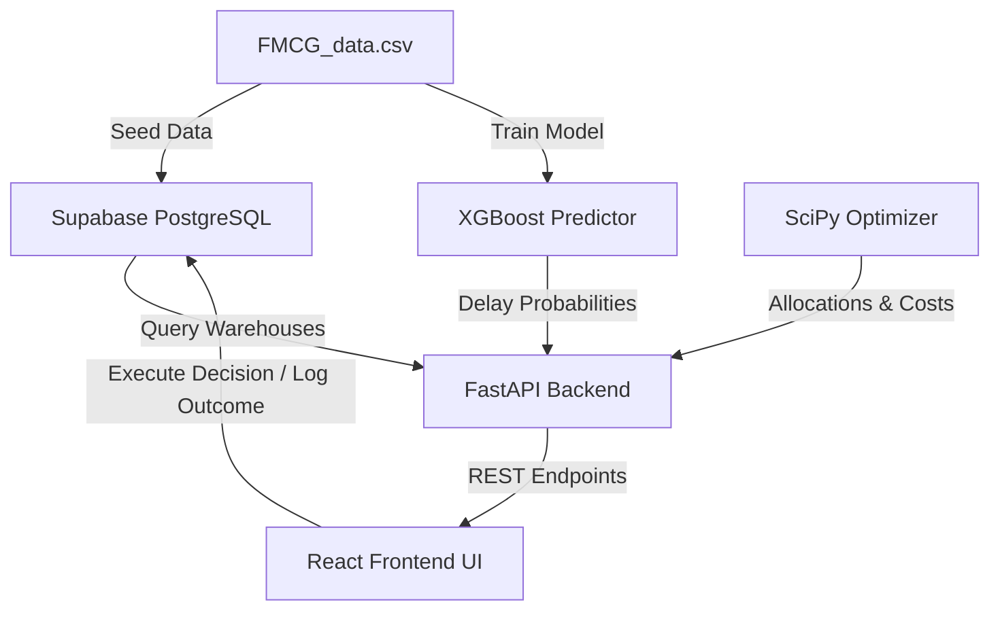

# SupplyPrescript Project Specification & Review Criteria

This skill provides comprehensive instructions on the system architecture, features, database models, and weekly review criteria for the **SupplyPrescript (Closed-Loop Prescriptive Analytics)** project.

---

## 🏗️ System Architecture

SupplyPrescript is a closed-loop prescriptive analytics system. It connects machine learning predictions (XGBoost) with mathematical optimization (SciPy linprog) and logs operational decisions to a database to close the learning loop.

---

## 💾 Database Schema

The database is hosted on **Supabase PostgreSQL** and contains the following tables:

### 1. `warehouses`
Stores warehouse metadata and current status.
*   `warehouse_id` (String, Primary Key)
*   `location_type` (String)
*   `capacity_size` (String)
*   `zone` (String)
*   `workers_num` (Float)
*   `dist_from_hub` (Float)
*   `transport_issue_l1y` (Integer)
*   `wh_breakdown_l3m` (Integer)
*   `product_wg_ton` (Float)
*   `status` (String, default "Normal")

### 2. `decisions`
Stores decisions executed by the operator.
*   `id` (Integer, Primary Key, Auto-increment)
*   `warehouse_id` (String, Foreign Key)
*   `selected_option` (String)
*   `prescribed_cost` (Float)
*   `expected_delay_days` (Integer)
*   `created_at` (DateTime)

### 3. `outcomes`
Logs actual real-world results to close the loop.
*   `id` (Integer, Primary Key, Auto-increment)
*   `decision_id` (Integer, Foreign Key)
*   `actual_cost` (Float)
*   `actual_delay_days` (Integer)
*   `evaluated_at` (DateTime)

---

## 📅 Weekly Review Criteria

### Week 1 Criteria (Status: Completed)
*   **App Scaffolding:** Set up a database connection (Supabase) and initialize a FastAPI server structure.
*   **Predictive Baseline:** Train an XGBoost model on historical data to predict shipment delays and save model artifacts.
*   **Validation:** Verify that REST endpoints connect to the database and retrieve seeded warehouse data successfully.

### Week 2 Criteria (Status: In Progress)
*   **Mathematical Optimization:** Integrate a SciPy `linprog` optimizer to calculate optimal shipping quantities across warehouses under budget and capacity constraints.
*   **Prescriptive API:** Implement the `/prescribe` endpoint to expose choices (A, B, and C) to the frontend.
*   **Prescriptive UI Scaffolding:** Build the React/Vite dashboard layout to display the warehouse tables, details, and action drawers.
*   **Mid-Project Review Audit:**
    1.  *Optimization Audit:* Verify the solver never recommends allocations that violate capacity or budget limits.
    2.  *Write-Back Check:* Confirm clicking "Execute Decision" in the UI successfully inserts a row into the `decisions` table.
