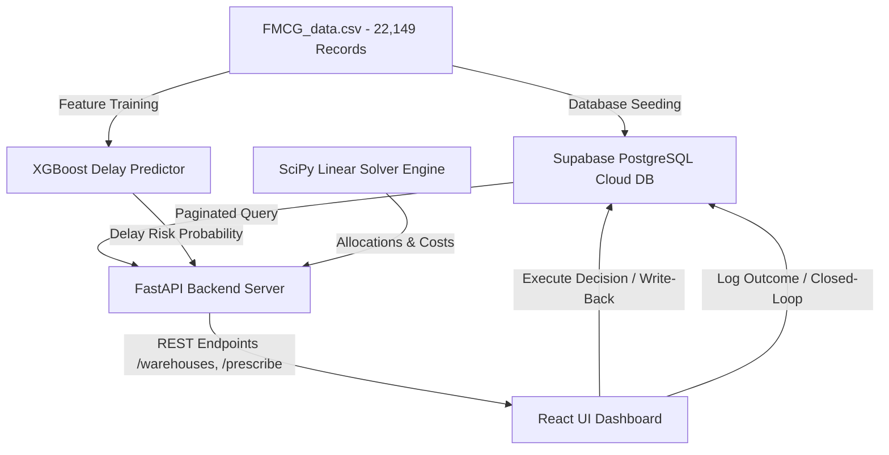
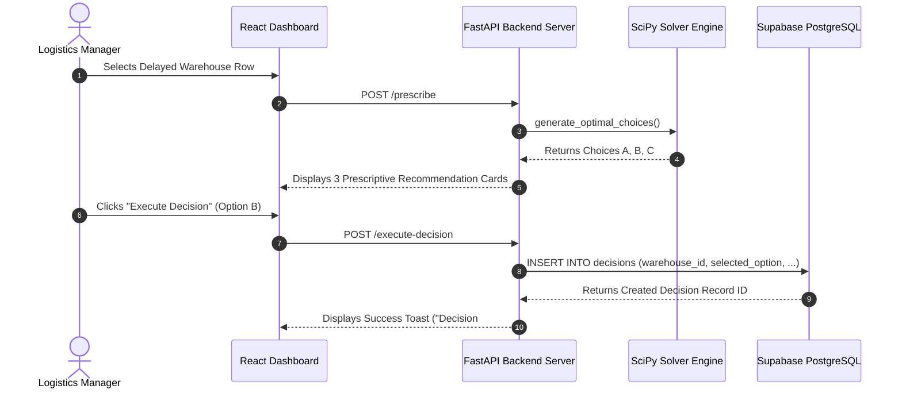
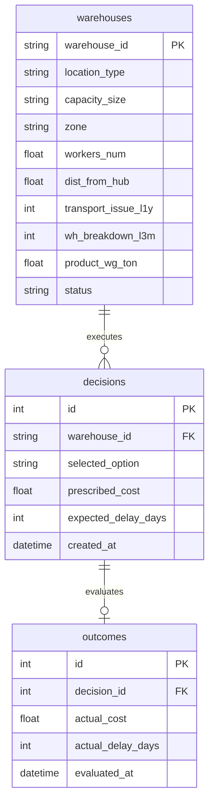

# 🚚 SupplyPrescript: Team Technical Explainer & Architecture Guide

**Project Title:** SupplyPrescript — Closed-Loop Prescriptive Analytics Platform  
**Target Domain:** FMCG Supply Chain Operations & Operations Research  
**GitHub Repository:** [dhrubojyotihazra/supply-prescript](https://github.com/dhrubojyotihazra/supply-prescript)  

---

## 📌 Executive Summary (Plain English)

Traditional business intelligence (BI) dashboards are **passive and read-only**. They tell managers *that* a delay is coming (**Predictive Analytics**), but leave the manager guessing what action to take. Furthermore, traditional dashboards don't learn from past choices.

**SupplyPrescript** transforms passive reporting into an **active, bidirectional decision engine**:
1. **Predicts:** Detects which warehouses are at risk of shipment delays using an XGBoost AI model.
2. **Prescribes:** Runs a **SciPy Linear Programming solver** to calculate the 3 best alternative actions (Choice A: High Budget/Fast, Choice B: Medium Budget/Balanced, Choice C: Low Budget/Economy).
3. **Writes Back:** Allows the manager to click **"Execute Decision"** on the React dashboard, performing an instant `INSERT` statement into a cloud **Supabase PostgreSQL database**.
4. **Closes the Loop:** Records real-world actual costs weeks later so future AI models can be retrained on actual discrepancies.

---

## 👥 Team Roles & Responsibilities Breakdown

| Role & Developer | Focus Area | Key Deliverables & Tech Stack |
| :--- | :--- | :--- |
| **Role A: Lead ML Engineer**<br>*(DineshReddy-Gajjala)* | XGBoost Predictive Engine | Trained `XGBClassifier` model on supply chain attributes to output delay probabilities $P(\text{Delay} \mid X)$. Saved artifact `engine/xgboost_model.joblib`. |
| **Role B: Feature Engineering**<br>*(karthikpuchaginjala)* | Dataset Analysis & Preprocessing | Cleaned and consolidated the **22,149-row dataset** (`data/FMCG_data.csv`), handling missing values and feature scaling. |
| **Role C: Optimization Developer**<br>*(Sameer0166)* | SciPy Linear Programming Solver | Wrote the mathematical solver (`scipy.optimize.linprog`) to calculate optimal shipping allocations under budget and capacity constraints. |
| **Role D: Backend & Database Developer**<br>*(dhrubojyotihazra - YOU)* | Cloud Database & FastAPI Write-Back | Built Supabase PostgreSQL database schemas (`warehouses`, `decisions`, `outcomes`), seeded 22k records, built FastAPI REST endpoints, and enabled server-side pagination & write-back. |
| **Role E: Frontend & Dashboard Developer**<br>*(ravichandranithin)* | React UI & Interactive Dashboard | Built the React + Vite dashboard (`frontend/`), featuring dark-mode glassmorphic styling, paginated table, prescriptive action cards drawer, and outcome logger. |

---

## 📐 Mathematical Formulation of the Optimization Solver

The prescriptive engine in `engine/prescriptive.py` solves a **Linear Programming (LP)** cost-minimization problem defined as follows:

### Objective Function
Minimize the total shipping allocation cost across $n$ warehouses:
\[
\min_{x_1, x_2, \dots, x_n} \sum_{i=1}^{n} c_i \cdot x_i
\]
Where:
*   $c_i$: Shipping cost per unit for warehouse $i$.
*   $x_i$: Quantity of inventory allocated to ship from warehouse $i$.

### Subject to Business Constraints

1.  **Warehouse Storage Capacity Bounds:**
    \[
    0 \le x_i \le \text{Capacity}_i \quad \forall i \in \{1, \dots, n\}
    \]
2.  **Maximum Target Budget Constraint:**
    \[
    \sum_{i=1}^{n} c_i \cdot x_i \le \text{Total Budget}
    \]
3.  **Minimum Demand Fulfillment Constraint:**
    \[
    \sum_{i=1}^{n} x_i \ge \text{Total Demand}
    \]

The solver evaluates this system across 3 budget tiers ($B_A = \$50,000$, $B_B = \$30,000$, $B_C = \$25,000$) to generate **Choice A, Choice B, and Choice C**.

---

## 🏗️ System Architecture & Data Flow



---

## 🔄 Sequence Diagram: Decision Execution Write-Back



---

## 💾 Database Schema (Supabase PostgreSQL)



---

## 🚀 How Team Members Can Run the Application Locally

1.  **Clone & Install Dependencies:**
    ```bash
    git clone https://github.com/dhrubojyotihazra/supply-prescript.git
    cd supply-prescript
    pip install -r requirements.txt
    ```

2.  **Start FastAPI Backend:**
    ```bash
    uvicorn api.main:app --reload
    ```
    *API Docs live at `http://127.0.0.1:8000/docs`.*

3.  **Start React Frontend UI:**
    ```bash
    cd frontend
    npm install
    npm run dev
    ```
    *Dashboard live at `http://localhost:5173`.*
